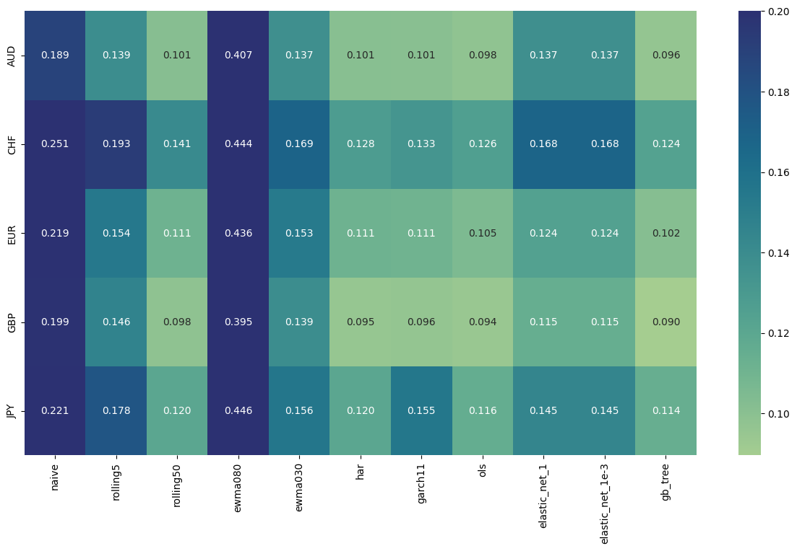
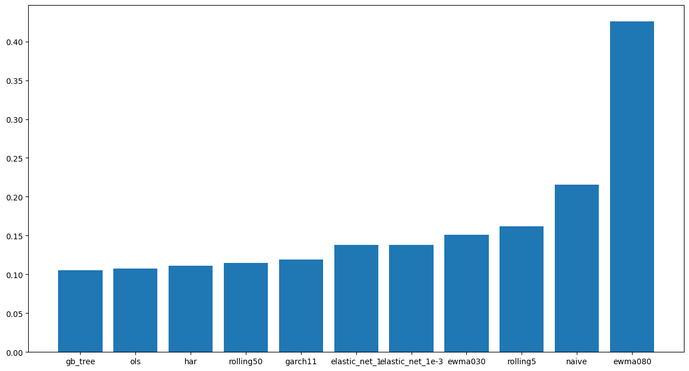
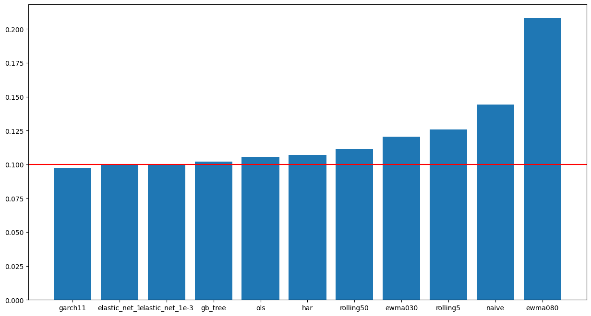
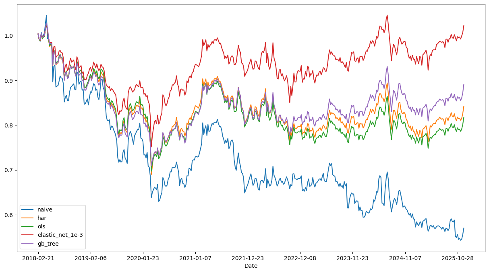

# FX volatility forecasting and volatility targeting

This project compares several models for forecasting FX realized volatility, and uses the forecasts to build a volatility targeting strategy.

## What this repo does

- Forecasts 5-day realized volatility for AUD, CHF, EUR, GBP, and JPY against USD using daily spot data from 2010 to 2025.
- Compares 11 models, from simple baselines to GARCH, elastic net, and gradient-boosted trees.
- Evaluates forecast quality using MAE, RMSE, and QLIKE.
- Uses the volatility forecasts to scale positions in a simple portfolio strategy.
- Shows that the statistically best forecasting model is not necessarily the one that gives the best portfolio-level volatility targeting.

## Key results

- Gradient-boosted trees and OLS give the best volatility forecasts across currencies.
- Better forecast accuracy does not necessarily lead to better volatility targeting.
- Elastic net gives the best portfolio-level volatility targeting and is the only model with slightly positive return.

## Summary

This project uses FX spot data from 2010-01-01 to 2025-12-31 for AUD, CHF, EUR, GBP, and JPY against USD, using daily close data. For each spot $(S^{(i)}_t)$, we compute the daily log returns

$$
r^{(i)}_t = \log \left( \frac{S^{(i)}_t}{S^{(i)}_{t-1}} \right)
$$

then the realized volatility over a horizon of $h$ days:

$$
\sigma^{(i)}_t = \mathrm{std}\left( r^{(i)}_t, r^{(i)}_{t-1}, \dots, r^{(i)}_{t-h+1} \right).
$$

The default value used for the results below is one week, that is $h = 5$.

We first compare different models for volatility forecasting: using data $(r^{(i)}\_t)\_{t \leq T}$, we aim to predict the realized volatility $\sigma^{(i)}\_{t+h}$ with a forecast $\hat{\sigma}^{(i)}\_{t+h}$. This shift avoids overlap, so that the features and targets are computed from non-intersecting sets of returns.

We then use these predictions to build a portfolio with a volatility targeting strategy. Given a target annual volatility $\sigma^{\*}$ for the portfolio (we use $\sigma^{\*} = 10\%$), we set weights

$$
w_t^{(i)} = \frac{\sigma^*}{\hat{\sigma}^{(i)}_{t+h}}
$$

for asset $i$. These positions are then held over the period $(t, t+h]$. If the assets are uncorrelated and the volatility predictions are good, we expect the annualized volatility of the portfolio to be close to $\sigma^*$.

## Volatility forecasting

Data exploration results and graphs can be found in [this notebook](./notebooks/01_data_exploration.ipynb). The backtesting and volatility targeting results are in the [results](./results/) folder, with more explanations and figures in [this notebook](./notebooks/02_summary.ipynb). Here is a summary.

### Models

We compare the following models for volatility forecasting.

- Naive model: the predicted value is the previous one.
- Rolling mean: the predicted value is the average of the $k$ previous ones (we take $k=5$ and $k=50$).
- [EWMA](https://pandas.pydata.org/pandas-docs/version/0.17.0/generated/pandas.ewma.html): the predicted value is an average of previous observations with exponentially decaying weights $\alpha^k$ (we take $\alpha = 0.8$ and $\alpha = 0.3$).
- [HAR](https://portfoliooptimizer.io/blog/volatility-forecasting-har-model/) model with lags 1, 5, 22, 66 (1 day, 1 week, 1 month, 3 months).
- [GARCH(1,1)](https://portfoliooptimizer.io/blog/volatility-forecasting-garch11-model/).
- Ordinary linear regression, using the same features as HAR (volatility with lags 1, 5, 22, 66), as well as the "vol of vol over a month", that is the standard deviation of the volatility over the last 22 days. The idea is that this may help capture volatility regimes.
- [Elastic net](https://en.wikipedia.org/wiki/Elastic_net_regularization) (OLS with $L^1$ and $L^2$ regularization), using parameters $\alpha = 1$ and $\alpha = 10^{-3}$.
- [Gradient boosted tree](https://scikit-learn.org/stable/modules/generated/sklearn.ensemble.GradientBoostingRegressor.html) with sklearn's default parameters.

### Metrics

Assume that we have targets $(\sigma_t)_{t \in S}$ and forecasts $(\hat{\sigma}\_t)\_{t \in S}$. Here, $S$ is the set of predicted dates, consisting of one value every 5 trading days after a burn-in period (taken by default to be half of the total length of the dataset). The metrics we use are:

- Mean Absolute Error:

$$
\mathrm{MAE} = \frac{1}{|S|} \sum_{t \in S} \left| \sigma_t - \hat{\sigma}_t \right|.
$$

- Root Mean Square Error:

$$
\mathrm{RMSE} = \sqrt{ \frac{1}{|S|} \sum_{t \in S} \left( \sigma_t - \hat{\sigma}_t \right)^2 }.
$$

- [QLIKE](https://public.econ.duke.edu/~ap172/Patton_robust_forecast_eval_11dec08.pdf) loss, which penalizes underestimation more than overestimation:

$$
\mathrm{QLIKE} = \frac{1}{|S|} \sum_{t \in S} \left( \frac{\sigma_t}{\hat{\sigma}_t} - \log \left( \frac{\sigma_t}{\hat{\sigma}_t} \right) - 1 \right).
$$

The metric usually favored is QLIKE, and the results below are ordered by increasing QLIKE. In practice, however, the results show that the choice of metric makes little difference.

### Results

#### QLIKE

The QLIKE loss for each model and currency is summarized in the following heatmap.



Averaging QLIKE over all currencies gives the following chart.



### All losses

The MAE, RMSE, and QLIKE, averaged over all currencies, are given in the following table.

|     Model             |      MAE |     RMSE |    QLIKE |
|----------------------:|---------:|---------:|---------:|
|               gb_tree | 1.67e-03 | 2.32e-03 | 1.05e-01 |
|                   ols | 1.68e-03 | 2.30e-03 | 1.08e-01 |
|                   har | 1.70e-03 | 2.33e-03 | 1.11e-01 |
|             rolling50 | 1.71e-03 | 2.38e-03 | 1.15e-01 |
|               garch11 | 1.89e-03 | 2.44e-03 | 1.19e-01 |
|         elastic_net_1 | 2.00e-03 | 2.60e-03 | 1.38e-01 |
|      elastic_net_1e-3 | 2.00e-03 | 2.60e-03 | 1.38e-01 |
|               ewma030 | 1.97e-03 | 2.71e-03 | 1.51e-01 |
|              rolling5 | 1.98e-03 | 2.72e-03 | 1.62e-01 |
|                 naive | 2.15e-03 | 2.95e-03 | 2.16e-01 |
|               ewma090 | 2.73e-03 | 3.70e-03 | 6.25e-01 |

Complete results are in the [notebook](./notebooks/02_summary.ipynb) or the [backtest](./results/backtest/) folder.

#### Conclusion

**The clear winners are gradient-boosted trees and OLS, and this is consistent across all currencies**. The industry-standard HAR and GARCH(1,1) models are slightly behind. Interestingly, these sometimes perform less well than a very simple rolling mean.

The gradient-boosted tree can capture some non-linearities that OLS does not, though the small difference suggests that these effects are limited. It is also likely that hyperparameter tuning and additional feature engineering could improve results further.

## Volatility targeting

We use a target annual volatility of 10%. Since FX volatility is only a few percentage points, this may require leverage, i.e. the weights defined above may sum to more than 1.

### Results

The following table summarizes annualized return, annualized volatility $\hat{\sigma}$, volatility error

$$
\left| \hat{\sigma} - \sigma^* \right|,
$$

Sharpe ratio, and maximum drawdown for each model.

|         Model         | ann_return | ann_vol | vol_error | Sharpe | max_dd |
|----------------------:|-----------:|--------:|----------:|-------:|-------:|
|         elastic_net_1 |       0.3% |   10.0% |     0.04% |   0.03 | -26.8% |
|      elastic_net_1e-3 |       0.3% |   10.0% |     0.04% |   0.03 | -26.8% |
|               gb_tree |      -1.4% |   10.2% |     0.20% |  -0.14 | -30.9% |
|               garch11 |      -2.2% |    9.7% |     0.25% |  -0.22 | -30.0% |
|                   ols |      -2.5% |   10.5% |     0.54% |  -0.23 | -32.1% |
|                   har |      -2.1% |   10.7% |     0.69% |  -0.20 | -32.8% |
|             rolling50 |      -3.2% |   11.1% |     1.13% |  -0.29 | -36.5% |
|               ewma030 |      -4.1% |   12.1% |     2.05% |  -0.34 | -36.4% |
|              rolling5 |      -3.4% |   12.6% |     2.58% |  -0.27 | -35.5% |
|                 naive |      -6.7% |   14.4% |     4.41% |  -0.47 | -48.1% |
|               ewma080 |     -10.4% |   20.8% |    10.78% |  -0.50 | -65.1% |

The main quantity of interest is the annualized volatility, summarized in the following graph.



It is interesting to see that **better volatility predictions do not necessarily imply better volatility targeting**. While models with poor predictions (e.g. naive, EWMA) also show poor volatility targeting, the best predictive models (GB tree, OLS) do not yield the best volatility targeting. Instead, the elastic net model, whose forecasting score is about 30% worse than GB tree, gives the best volatility targeting. This is likely due to **regularization producing more stable predictions**.

As shown in the table above, the elastic net model is also the only one that yields a slightly positive return, despite the downward trend of all FX spots except JPY.



## Repo structure

- [`src/fxvol/`](./src/fxvol/) contains the main project code.
- [`scripts/`](./scripts/) contains the scripts used to download data, clean it, run backtests, and summarize results.
- [`notebooks/`](./notebooks/) contains the exploratory and summary notebooks.
- [`results/`](./results/) contains backtest outputs and summary tables.
- [`pictures/`](./pictures/) contains the figures used in this README.

## How to run

This project uses [uv](https://docs.astral.sh/uv/). First clone the project, then run

```
uv sync
```
The data can be obtained from Yahoo Finance with
```
uv run scripts/get_data.py
```
Then clean data (a few rows missing) and save log returns with
```
uv run scripts/clean_data.py
```
Run the backtests for all models with
```
uv run scripts/run_backtests.py
```
Run the volatility targeting strategy and save the returns with
```
uv run scripts/comp_strat_returns.py
```
Finally, summary of the metrics for each model are computed and saved with
```
uv run scripts/summarize_strats.py
```

